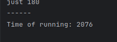
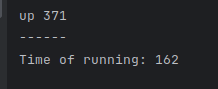

ОПТИМІЗАЦІЯ ПО ЧАСУ

Час виконання програми в початковому вигляді :

Для зменшення часу виконання будемо використовувати бібліотеку Java 8 - Streams
Стріми працюють з колекціями, а не звичайними масивами. Вони напрямлені на збільшення
швидкості обробки порівняно зі звичайними циклаим for. 

Також замість того, щоб декілька разів проходитись циклами по словах і визначати частоту
повторів, ми можемо одразу обрахувати кількість слів використовуючи колектор                 .collect(Collectors.groupingBy(Function.identity(), Collectors.counting()));
Function.identity() дозволяє обирати унікальні слова, а Collectors.counting() рахує їх частоту
В результаті отримаємо час виконання набагато менший ніж спочатку :

